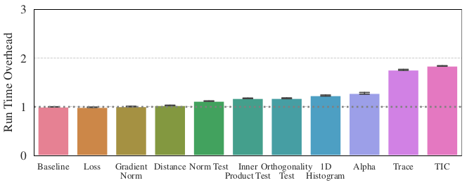
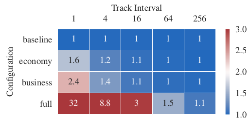

# Instructions to reproduce this benchmark

## Overhead of individual quantities

1. Run experiment: `python run_individual.py`. Alternatively, extract original data: `unzip results_individual.zip`
2. Create plots and move them to the tex directory: `python plot_individual.py`.
   Plots can be found in `fig_individual`.
3. Clean up or start over: `bash clean_individual.sh`

## Overhead of configurations at different tracking rates

1. Run experiment: `python run_grid.py`. Alternatively, extract original data: `unzip results_grid.zip`
2. Create plots and move them to the tex directory: `python plot_grid.py`. Plots
   can be found in `fig_grid`.
3. Clean up or start over: `bash clean_grid.sh`
