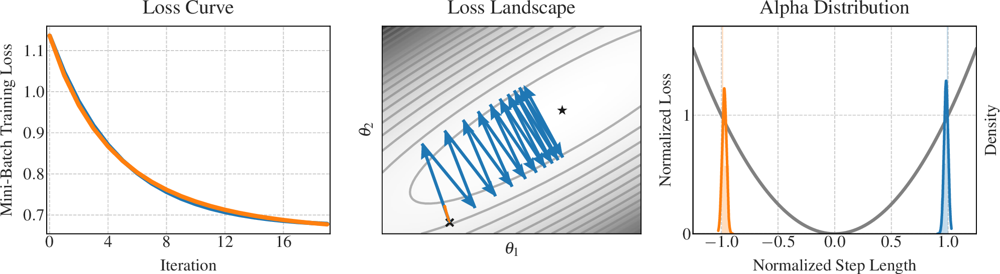

# Loss is not Enough

This experiment compares two optimization trajectories against each other. For these two trajectories, we observe virtually the same loss curve, however, the actual movement in the loss landscape is dramatically different. We show that with the alpha distribution, we are able to distinguish both cases easily.

1. Run experiment: `python run.py` (creates a `results` directory with two `__log` files for the blue and orange optimization trajectory).
   Alternatively, extract the `results.zip` to use our original results: `unzip results.zip`.
2. Plot results: `python plot.py`. If you created the results yourself, you need to change the path to the `__log` files in the `plot.py`. Find the plot in the `output directory`.
3. Clean up or start over: `bash clean.sh` (removes `results`)
