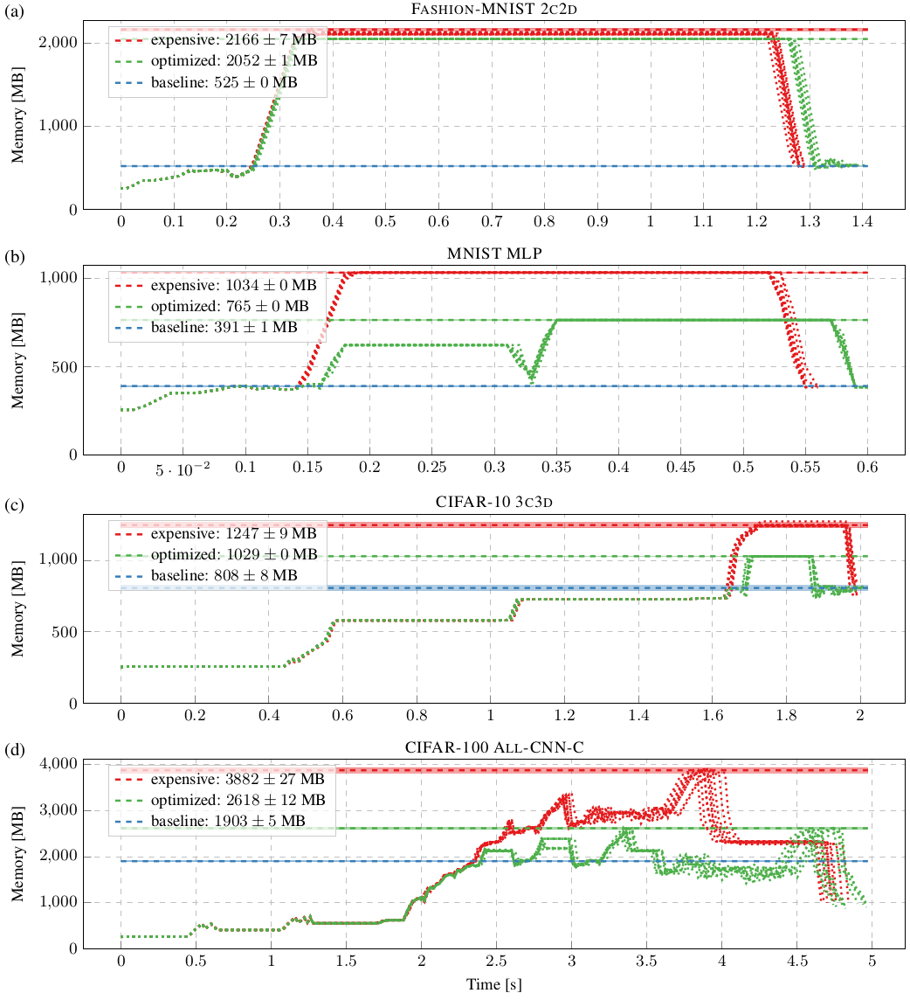

# Instructions to reproduce this benchmark

1. (Optionally) extract `data.zip` if you want to use the original data: `unzip
   data.zip`.
2. Run experiment and create plots: `bash run.sh`. Plots are in the `fig` directory.
3. Clean up or start over: `bash clean.sh`
