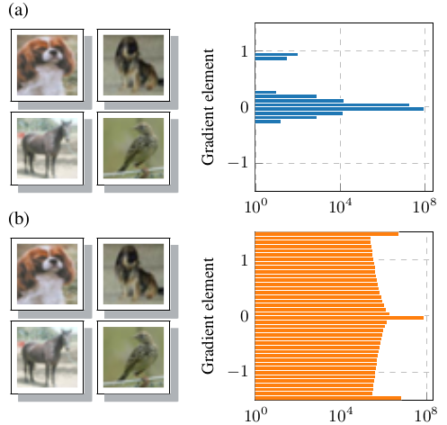

# Instructions to reproduce this experiment

## CIFAR-10 images
1. Run experiment: `python run_samples.py`. Find the images in `fig_samples`.
2. Clean up or start over: `bash clean_samples.sh`

## Gradient element distribution
1. (Optional) Extract `results.zip` to use the original data: `unzip results.zip`.
2. Run experiment: `python run_histograms.py`
3. Plot the results: `python plot_histograms.py`. Find the images in `fig_histogram`.
4. Clean up or start over: `bash clean_histograms.sh`
