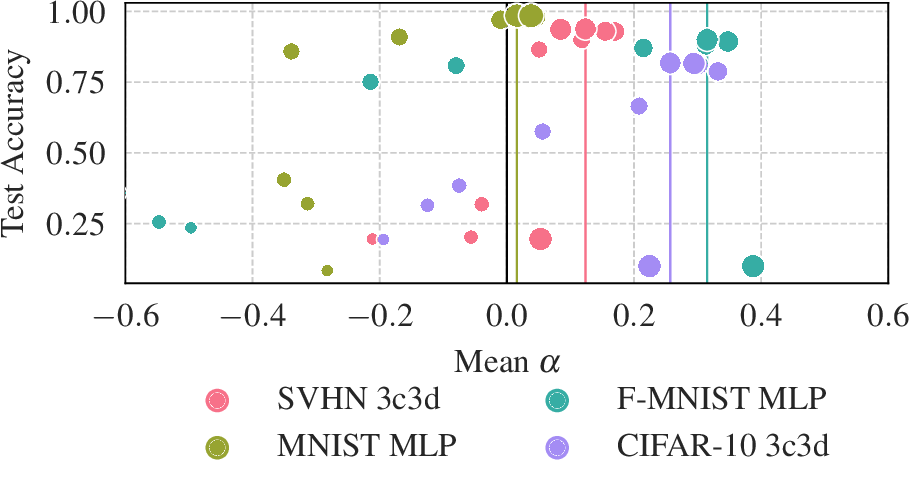

# Tuning the Learning Rate with Alpha

This experiment performs a grid search for the learning rate on four different problems with Cockpit tracking. Afterward, we can plot the mean Alpha value of each run versus the final performance (measured as test accuracy). We can observe that the best performing learning rate is not the one with a mean Alpha closest to zero. Perhaps surprisingly it is consistently a run with a mean Alpha larger than zero.

Note that the run files require additional data sets (MNIST, FMNIST, SVHN, CIFAR-10) to be downloaded, which they will do automatically.

1. Run experiment: `python run_XX.py` to start the grid search on one of the four problems. This will create a `results` directory with four subfolders for the problems.
   Alternatively, extract the `results.7z.*` files (split to achieve smaller archives) to use our original results: `7z x results.7z.001`.
2. Plot results: `python plot.py`.
3. Clean up or start over: `bash clean.sh` (removes `results`)
