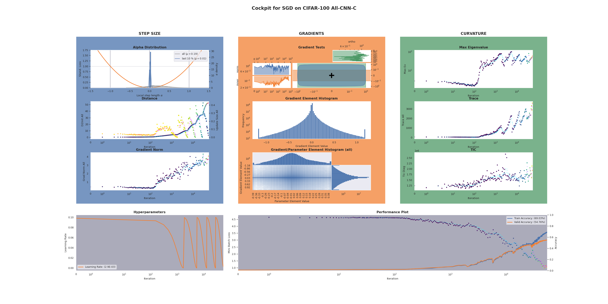

# Showcase of the Cockpit

This experiment compares two optimization trajectories against each other. For these two trajectories, we observe virtually the same loss curve, however, the actual movement in the loss landscape is dramatically different. We show that with the alpha distribution, we are able to distinguish both cases easily.

1. (Optionally) Extract the original data if you want to use it: `unzip results.zip`.
2. Run experiment: `python run_XX.py` to start the training with Cockpit on one of the three problems. This creates a `results` directory with folders for each problem. It will also produce snapshots of the Cockpit in regular intervals and a animation of the whole training process in the end.
3. The showcases can be extracted from the `results` directory. In the paper we used the final snapshot of each problem (i.e. the file without any epoch or step naming). You can also search for `showcase.gif` to find the animations.
