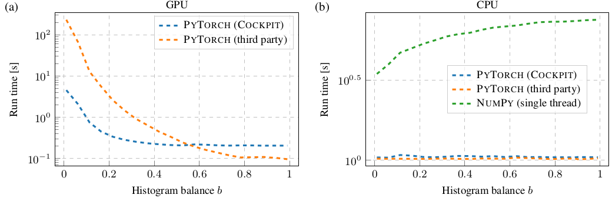

# Instructions to reproduce this experiment

1. (Optional) Extract `results.zip` to use the original data: `unzip
   results.zip`
2. Run experiment: `python run.py`
3. Plot the results: `python plot.py`. Find the images in `fig`.
4. Clean up or start over: `bash clean.sh`
