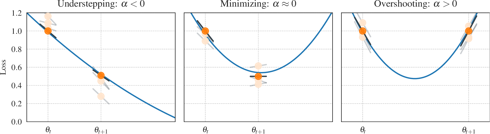

# Motivational Sketch for Alpha

This experiments illustrates the three main scenarios for the Alpha quantity. Using toy data, we show three different iterations, each with two observations of the loss and its slope. They result in three different approximations for the loss function. Based on these approximations we can estimate where with respect to the minimum we are stepping.

1. Plot illustration: `python plot.py`.
